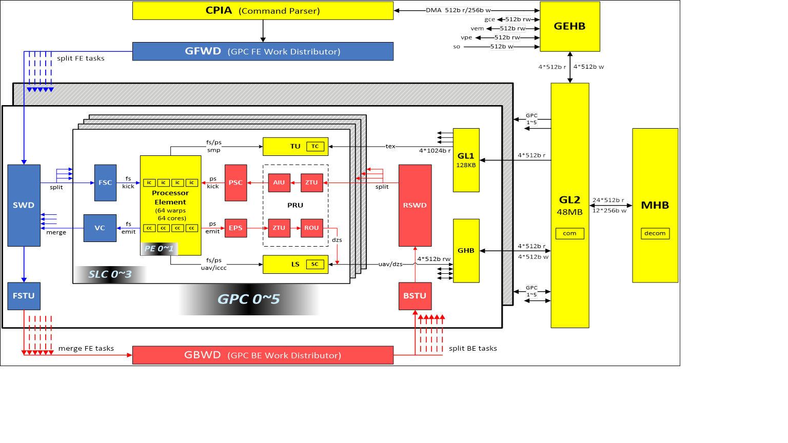
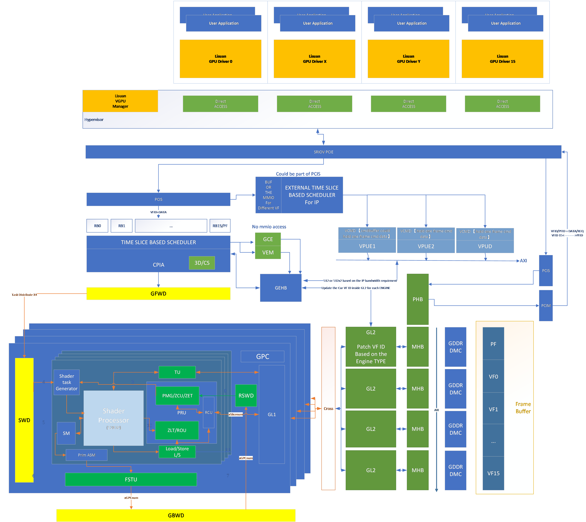

# Top

| level | unit      | decs    |
| ----- | --------- | ------- |
| 0     | EU        | per PB  |
| 0.5   | TC,SC,PRU | per SLC |
| 1     | GL1       | per GPC |
| 2     | GL2       | TOP     |~~~~

# Top Diagram

## Attr Table

| **CPIA**      | CPIA      | Commnad Parser and input assembler        |
| ------------------- | --------- | ----------------------------------------- |
|                     | PFP       | Perfetch parser                           |
|                     | CP        | commnad Parser                            |
|                     | RBC       | SW ring buffer controller                 |
|                     | MRWC      | memory read/write controller              |
|                     | RSB       | Rigister shadow buffer                    |
| **GFWD**      | GFWD      | GPC Front end work distributor crossbar   |
| **FSTU**      | FSTU      | Front end of setup unit                   |
|                     | PST       | Position setup                            |
|                     | AST       | Attribute setup                           |
| **GBWD**      | GBWD      | GPC Backend  work distributor crossbar    |
| **BSTU**      | BSTU      | Backend of setup unit                     |
| **PRU**       | PRU       | Post raster unit                          |
| **RSWD**      | RSWD      | Rasterizer work distributor crossbar      |
| **ZTU**       | ZTU       | Z test Unit                               |
|                     | PMG       | pixel mask gfeneration                    |
|                     | ZCU       | Z cull unit                               |
|                     | ZET       | z early test                              |
|                     | ZLT       | z late test                               |
| **ROU**       | ROU       | Rendering output unit                     |
| **AIU**       | AIU       | Attribute Interpolation UNIT              |
| **EU**        | EU        | Excution unit                             |
|                     | EUC       | Excution unit Cluster                     |
|                     | PE        | Process element                           |
|                     | SWD       | Shader work distributer                   |
|                     | SCH       |                                           |
|                     | ALUG      | ALU GROUPS, the ALU inside one PB         |
| **RCU**       | RCU       | Rop Cache Unit                            |
| **GCOM/GDEC** | GCOM/GDEC | GPU Compression /DECOM Unit               |
| **MHB**       | MHB       | Memory HUB                                |
|                     | MMU       | Memory map unit                           |
|                     | CLU       | compression length unit                   |
|                     | PHB       | peripheral HUB                            |
|                     | DPE       | Dsiplay engine                            |
|                     | PCIS      |                                           |
|                     | PCIM      |                                           |
| **LSU**       | LSU       | Load/store unit                           |
| **DMC**       | DMC       | DRAM Memory Control                       |
| **GCE**       | GCE       | Global copy engine                        |
| **TU**        | TU        | Texture UNIT                              |
|                     | TSC       | Texture Space Converter                   |
|                     | TCU       | Texture Cache Control Unit                |
|                     | TDP       | Texture Data Path                         |
| **SECP**      | SECP      | Security Processor                        |
| **VEM**       | VEM       | Video enhanced Module                     |
| **GEHB**      | GEHB      | Global Engine HUB                         |
| **SLICE**     | SLICE     | Including EU/TEX or maybe FF              |
| **GPC**       | GPC       | Group of Slice, Graphic processor cluster |
| **GL1**       | GL1       | GPC L1 Cache                              |
| **GL2**       | GL2       | Global L2 Cache                           |
| **PCNT**      | PCNT      | Performance Count UNIT                    |
| **VPE**       | VPE       | Video processor enginee                   |
| **GHB**       | GHB       | GPC HUB UNIT                              |
| PB                  | PB        | Processor Block                           |
