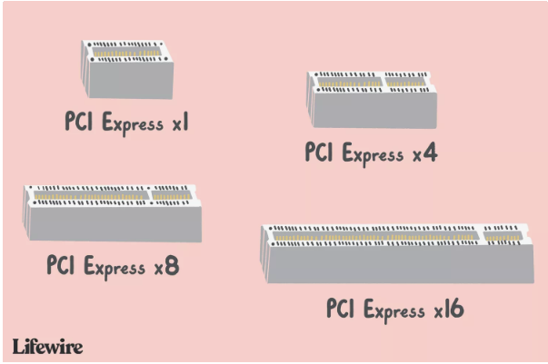

# Pcie
PCI Express Peripheral Component Interconnect Express

PCI Express 替代 AGP ,PCI
PCIe 是主板mother board 的标准内部接口

## Why Pcie

The PCI Express interface allows high bandwidth communication between the device and the motherboard, and other hardware.

提供更高的带宽
Thanks to the demand for faster and more realistic video games and video editing tools, video cards were the first types of computer peripherals to take advantage of the improvements offered by PCIe.
While video cards are easily still the most common type of PCIe card you'll find, other devices that benefit from considerably faster connections to the motherboard, CPU, and RAM are also increasingly manufactured with PCIe connections instead of PCI ones.

PCIe主要有两个特性
• physical size
• technology version

physical size
As the heading suggests, the number after the x indicates the physical size of the PCIe card or slot, with x16 being the largest and x1 being the smallest

No matter the size of the PCIe slot or card, the key notch, that little space in the card or slot, is always at Pin 11. In other words, it's the length of Pin 11 that keeps getting longer as you move from PCIe x1 to PCIe x16. It allows some flexibility to use cards of one size with slots of another.
PCIe cards fit in any PCIe slot on a motherboard that is at least as big as it is. For example, a PCIe x1 card will fit in any PCIe x4, PCIe x8, or PCIe x16 slot. A PCIe x8 card will fit in any PCIe x8 or PCIe x16 slot.

pin11 的会随着长度变大而变长
PCI Express Size Comparison Table		
Width	Number of Pins	Length
PCI Express x1	18	25 mm
PCI Express x4	32	39 mm
PCI Express x8	49	56 mm
PCI Express x16	82	89 mm

