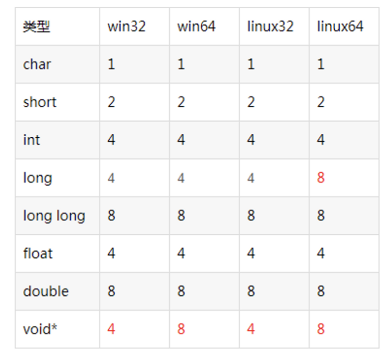

## Variables Type Size



## .h ,.c, .hpp,.cpp

```cpp
*.h , *.c  是c语言的头文件和实现

*.h  header进行声明，使用直接进行include即可
------------------------------------------------------
*.hpp ， *.cpp 是c plus plus的头文件及实现

一个cpp在编译器编译之后对应一个*.obj，链接器将所有obj链接起来生成可以执行文件

*.hpp  header plus plus
**本质就是将cpp文件中的实现混入到头文件中，实现和定义都包含在同一个文件
类调用者只需要include该hpp文件即可，无需再将cpp文件假如到project中进行编译**
```

* 优点

```cpp
*.hpp 实现代码将直接编译到调用者的obj文件中，不再生成单独的obj，采用hpp将大幅度减少调用 project中的cpp文件数与编译次数，也不用再发布烦人的lib与dll，因此非常**适合用来编写公用的开源库**
```

* 缺点

```cpp
1.不可包含全局对象和全局函数
2.类之间不可循环调用
3.不可使用静态成员
```

## pch

> *Precompiled header file.*

> *Pre-compiled header*
>
