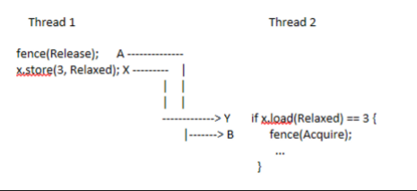

# Fence

**std::sync::atomic::fence**

An atomic fence.

Depending on the specified order, a fence prevents the compiler and CPU from reordering certain types of memory operations around it. That creates synchronizes-with relationships between it and atomic operations or fences in other threads.

A fence ‘A’ which has (at least) Release ordering semantics, synchronizes with a fence ‘B’ with (at least) Acquire semantics, if and only if there exist operations X and Y, both operating on some atomic object ‘M’ such that A is sequenced before X, Y is sequenced before B and Y observes the change to M. This provides a **happens-before dependence between A and B**.

